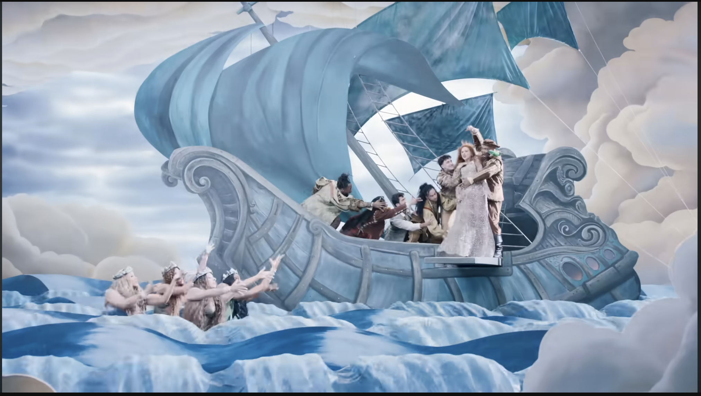
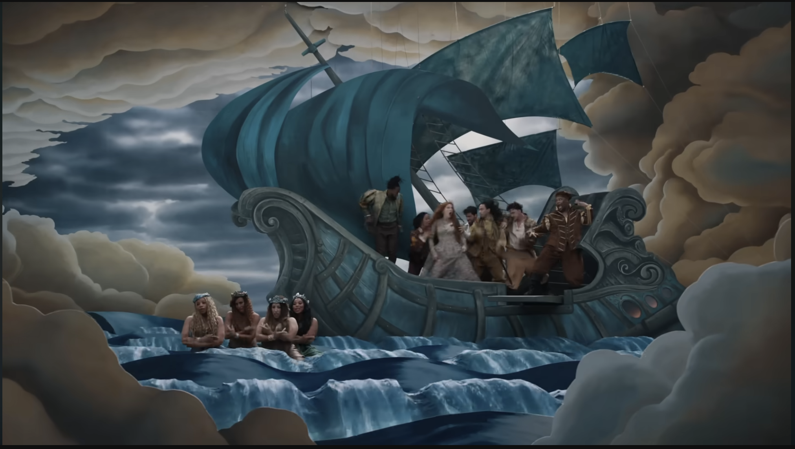
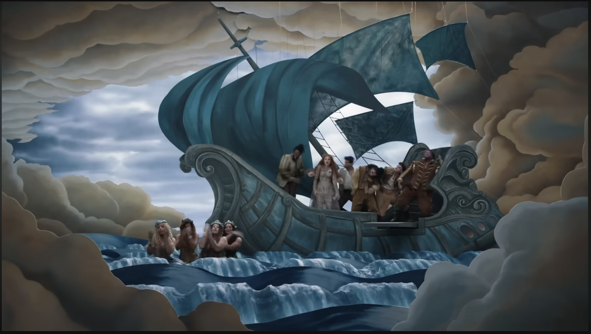
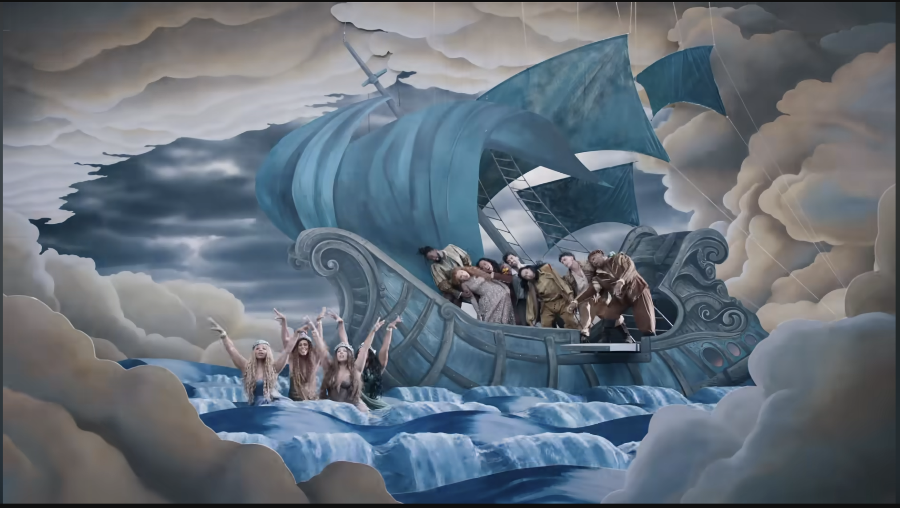
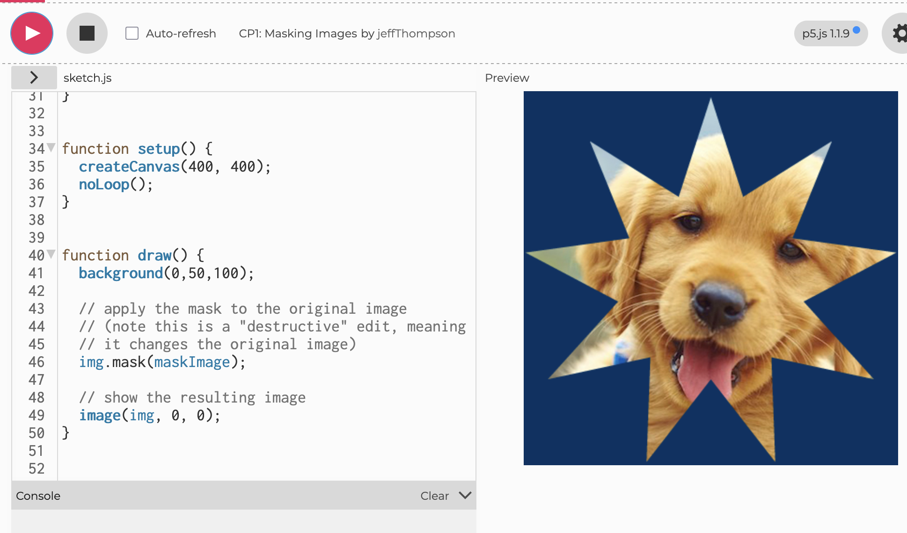

#### aqur5391_9103_tut2

# IDEA9103 Quiz 8
### Part 1: Imaging Technique Inspiration

For my project I am going to be turning __*"The Scream”*__ into an interactive artwork. I have found creative inspiration from a music video: [Taylor Swift - The Fate of Ophelia (official music video)](https://www.youtube.com/watch?v=ko70cExuzZM&list=RDko70cExuzZM&start_radio=1).

I aim to incorporate the following effects:

- *a ‘lightning’ effect that lights up the background, mid-ground and fore-ground of the image at different times*

- *a flowing of water effect that occurs while surrounding image regions stay still*

These effects are beneficial in that they allow for user interaction to influence the artwork in visually appealing and engaging ways, whilst still retaining essential aesthetics of the original artwork.

###### Note: the effects I am referring to can be seen at time 1:48 to 2:08 of the music video.

#

### Part 2: Coding Technique Exploration

A coding technique that may assist in achieving the above effects is **masking**. The reason for this is that I need to devise a method to categorise the coloured pixels that make up the different pieces of the artwork (e.g. the figures, water, sky, etc.).

After exploring the example below, I had the idea to extend the concept of masking to accomplish this, so that I can then separately animate those different regions **at different times**, and do so based on **different user inputs**. 

[**Masking Code Example**](https://editor.p5js.org/jeffThompson/sketches/AnJcOmOPJ)

[**Masking Code Tutorial**](https://www.youtube.com/watch?v=V-8FE_IQONY)

